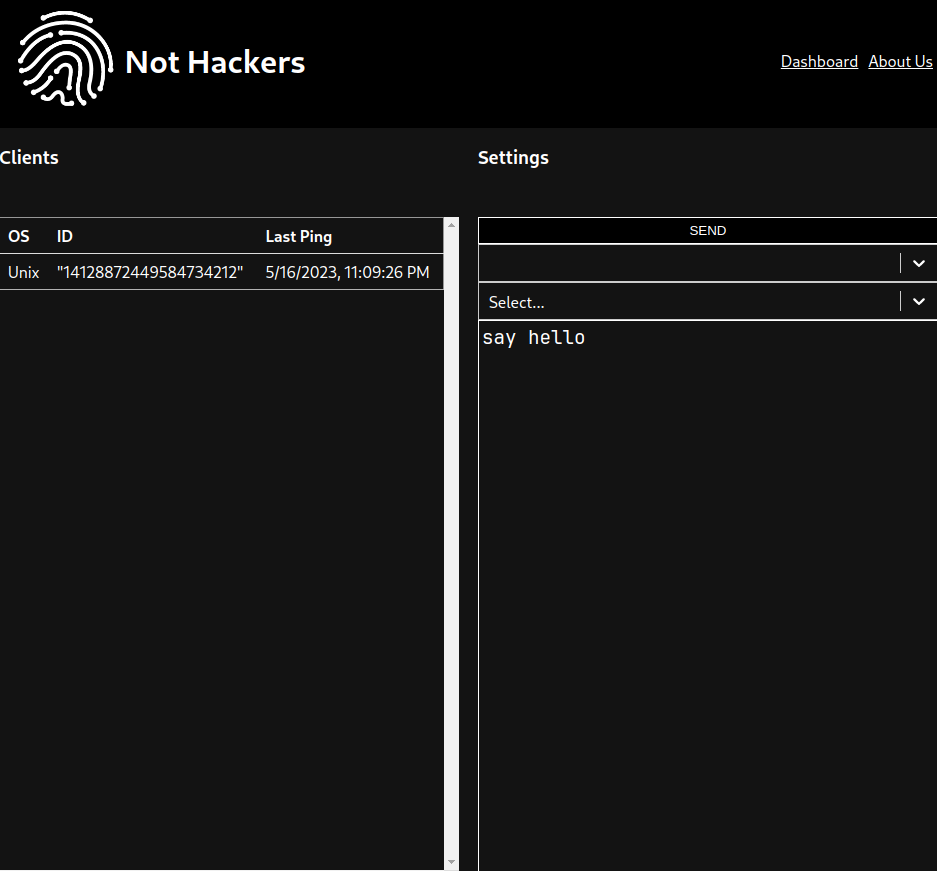

# Remote IT

Remote IT is a series of solutions for modern problems

**This project is only meant for memes and jokes, and is not meant for any malicious activities. We take no legal responsibility for any damage caused by them.**

## Why
Remote IT was developed as a project for a grade 12 computer science class by two guys.
The first concepts was a way to access computers without having control of computer ports and/or port forwarding, but as time went on, it became a full solution with both hardware and software involved

## How
Remote IT consists of two parts:
- C&D - A series of arduino programs and a sick piece of hardware to download things
- ROT - Remote operating toaster

### [C&D](https://github.com/notHackers/arduino)
C&D is a solution to a surprising amount of 'problems'
It consists of an Arduino Leonardo clone, an SD card reader, and some other bits and bobs to make it more functional.
See [this](C&D) for more.

### [ROT](https://github.com/notHackers/rot)
ROT is a set of 3 1/2 progams:
- Frontend - A react app built to  view things nicely, it kinda sucks, I'm not a frontend dev
- Server - A HTTP REST server that handles things, actually, everything
- Installer/Client :
	- The installer installs the client
	- The client connects to the server through REST requests

See [this](https://github.com/notHackers/rot) for more info
## How to use it

1. Have an arduino capable of serial communication, preferably one with  direct serial control (not  an UNO)
2. Check out the image, no, I will give a schematic
3. choose the program you want to download and the script that relates to it
4. upload the arduino program and put the program to be injected onto the SD card
5. Plug it and run it!
